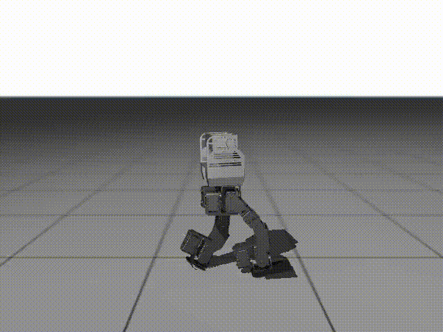

# Dextra Robot Motion Imitation

A reinforcement learning framework for motion imitation of the Dextra robot. This project uses the DeepMimic algorithm to train walking motion controllers for the Dextra robot's lower body.

## Video Demonstration

### Reference Motion
The reference walking motion used for training:



### Simulation Results
Trained policy running in Isaac Gym simulation:


### Sim-to-Real Transfer
Policy transferred from simulation to real-world deployment:

[📹 Download Sim-to-Real Video](images/Sim-to-Real.mp4)

## Overview

This project is based on the MimicKit framework and focuses on learning walking motion for the Dextra robot's lower body. It uses DeepMimic and PPO algorithms to learn control policies that imitate reference motions.

## Dextra Robot

Dextra is a humanoid robot with a focus on lower body locomotion. This project uses Dextra's lower body (`Dextra_lowerbody`) to learn walking motions.

### Robot Structure
- **Robot File**: `data/assets/Dextra_lowerbody/Dextra_lowerbody.xml`
- **Key Joints**: Hip, knee, and ankle joints (left and right)
- **DOF**: 12 DOF (lower body)

## Installation

### Requirements

1. **Install IsaacGym**
   - Install NVIDIA IsaacGym: https://developer.nvidia.com/isaac-gym

2. **Install Python Packages**
   ```bash
pip install -r requirements.txt
```

3. **Assets and Motion Data**
   - Dextra robot model and mesh files are located in `data/assets/Dextra_lowerbody/`
   - Walking motion data is available in `data/motions/dextra_walking.pkl`

## Training

### How to Train a Policy

The training process uses DeepMimic with PPO to learn a walking policy for the Dextra robot. The agent learns to imitate a reference motion by maximizing rewards based on pose similarity, velocity matching, and root position tracking.

#### Step 1: Basic Training

Start training with default settings:
```bash
python mimickit/run.py \
    --mode train \
    --num_envs 4096 \
    --env_config data/envs/deepmimic_dextra_lowerbody_env.yaml \
    --agent_config data/agents/deepmimic_dextra_lowerbody_ppo_agent.yaml \
    --visualize false \
    --log_file output/log.txt \
    --out_model_file output/model.pt
```

Or use a pre-configured argument file:
```bash
python mimickit/run.py \
    --arg_file args/deepmimic_dextra_lowerbody_ppo_args.txt \
    --visualize false
```

#### Step 2: Training Process

During training, the system will:
1. Initialize 4096 parallel simulation environments
2. Collect experience using the current policy
3. Update the policy using PPO algorithm every 32 steps
4. Save model checkpoints periodically (every 500 iterations by default)
5. Log training statistics to `log.txt` and TensorBoard

#### Step 3: Monitor Training

Watch training progress in real-time:
```bash
# In another terminal, start TensorBoard
tensorboard --logdir=output/ --port=6006
```

Or view the log file:
```bash
tail -f output/log.txt
```

#### Step 4: Training Parameters

Key training parameters you can adjust:

**Environment Parameters** (`data/envs/deepmimic_dextra_lowerbody_env.yaml`):
- `motion_file`: Reference motion file (`dextra_walking.pkl` or `dextra_walking_improved.pkl`)
- `episode_length`: Episode duration in seconds (default: 5.0)
- `reward_pose_w`: Weight for pose matching reward (default: 0.5)
- `reward_vel_w`: Weight for velocity matching reward (default: 0.1)
- `reward_root_pose_w`: Weight for root position reward (default: 0.15)

**Agent Parameters** (`data/agents/deepmimic_dextra_lowerbody_ppo_agent.yaml`):
- `learning_rate`: PPO learning rate (default: 5e-5)
- `batch_size`: Batch size for policy updates (default: 4)
- `update_epochs`: Number of update epochs per iteration (default: 5)
- `ppo_clip_ratio`: PPO clipping ratio (default: 0.2)

**Command Line Parameters**:
- `--num_envs`: Number of parallel environments (more = faster training, default: 4096)
- `--max_samples`: Maximum training samples (default: unlimited)
- `--visualize`: Enable visualization (`false` recommended for training)
- `--logger`: Choose `tb` (TensorBoard) or `wandb` for logging

#### Step 5: Save and Resume Training

Models are automatically saved:
- Final model: `output/model.pt`
- Checkpoints: `output/model_0000000500.pt`, `output/model_0000001000.pt`, etc.

To resume training from a checkpoint:
```bash
python mimickit/run.py \
    --arg_file args/deepmimic_dextra_lowerbody_ppo_args.txt \
    --model_file output/model_0000005000.pt \
    --mode train
```

## Running a Trained Policy

### How to Run a Trained Policy

Once you have a trained model, you can run it to see the robot perform the learned walking motion.

#### Using the Pretrained Model

A pretrained model is available in the repository:
```bash
python mimickit/run.py \
    --mode test \
    --num_envs 4 \
    --env_config data/envs/deepmimic_dextra_lowerbody_env.yaml \
    --agent_config data/agents/deepmimic_dextra_lowerbody_ppo_agent.yaml \
    --visualize true \
    --model_file output/flat_foot_improved/model.pt
```

#### Using Your Own Trained Model

If you trained your own model:
```bash
python mimickit/run.py \
--mode test --num_envs 4 \
--env_config data/envs/deepmimic_dextra_lowerbody_env_improved_motion.yaml \
--agent_config data/agents/deepmimic_dextra_lowerbody_ppo_agent.yaml \
--log_file output/{your_output_file}/dextra_log.txt \
--model_file output/{your_output_file}/model.pt  --visualize true
```

#### Running Without Visualization
If you want to execute training with our config...
```bash
python mimickit/run.py \
--mode train --num_envs 4096 \
--env_config data/envs/deepmimic_dextra_lowerbody_env_improved_motion.yaml \
--agent_config data/agents/deepmimic_dextra_lowerbody_ppo_agent.yaml --visualize false \
--log_file output/{your_output_file}/dextra_log.txt \
--out_model_file output/{your_output_file}/model.pt \
--int_output_dir output/{your_output_file}
```

#### Policy Execution Parameters

- `--mode test`: Run in test mode (no training)
- `--num_envs`: Number of parallel environments (4-8 recommended for visualization, more for evaluation)
- `--visualize`: Set to `true` to see the robot simulation
- `--model_file`: Path to the trained model file (`.pt` file)
- `--test_episodes`: Number of episodes to run (default: unlimited)

#### What to Expect

When running a trained policy, you should see:
- The Dextra robot performing a walking motion
- The robot maintaining balance and following the reference motion
- Episode statistics printed to the console (mean return, episode length, etc.)

The policy will run until you stop it (Ctrl+C) or until the specified number of test episodes is reached.

## Behavioral Cloning (BC)

You can collect data from a trained model and train a BC model using that data.

### 1. Data Collection (Rollout)

```bash
python mimickit/run_bc.py \
    --mode rollout \
    --num_workers 1 \
    --num_envs 4 \
    --env_config data/envs/deepmimic_dextra_lowerbody_env.yaml \
    --agent_config data/agents/deepmimic_dextra_lowerbody_ppo_agent.yaml \
    --model_file output/model.pt \
    --rollout_episodes 100 \
    --rollout_file output/bc_data/rollout_dataset.npz \
    --visualize false
```

### 2. BC Model Training

```bash
python bc/train.py \
    --data_path output/bc_data/rollout_dataset.npz \
    --output_dir output/bc_model \
    --batch_size 64 \
    --epochs 100 \
    --lr 1e-3 \
    --device cuda
```

For more details, see [`bc/README.md`](bc/README.md).

## Motion Visualization

Visualize reference motion clips:
```bash
python mimickit/run.py \
    --mode test \
    --arg_file args/view_motion_dextra_lowerbody_args.txt \
    --visualize true
```

## Training Log Visualization

### TensorBoard
```bash
tensorboard --logdir=output/ --port=6006
```

### Plot Log File
```bash
python tools/plot_log/plot_log.py --log_file output/log.txt
```

## Motion Data

- **Basic Walking Motion**: `data/motions/dextra_walking.pkl`
- **Improved Walking Motion**: `data/motions/dextra_walking_improved.pkl`

Motion files are stored in `.pkl` format, where each frame follows the format:
```
[root position (3D), root rotation (3D), joint rotations]
```

## Pretrained Models

A pretrained walking policy is available:
- **Location**: `output/flat_foot_improved/model.pt`
- **Description**: Trained policy for Dextra lower body walking with improved motion
- **Usage**: See [Running a Trained Policy](#running-a-trained-policy) section above

## Output Files

After training, the following files are generated in the `output/` directory:
- `model.pt`: Final trained model parameters
- `model_XXXXXX.pt`: Checkpoint files saved at regular intervals
- `log.txt`: Training statistics log (rewards, losses, etc.)
- `env_config.yaml`: Copy of environment configuration used for training
- `agent_config.yaml`: Copy of agent configuration used for training
- `events.out.tfevents.*`: TensorBoard event files (when using TensorBoard logger)

## Project Structure

```
MimicKit/
├── data/
│   ├── assets/
│   │   └── Dextra_lowerbody/      # Dextra lower body robot model
│   ├── envs/
│   │   └── deepmimic_dextra_lowerbody_env.yaml
│   ├── agents/
│   │   └── deepmimic_dextra_lowerbody_ppo_agent.yaml
│   └── motions/
│       ├── dextra_walking.pkl
│       └── dextra_walking_improved.pkl
├── bc/                              # Behavioral Cloning code
├── mimickit/                        # Main framework
├── args/                            # Training configuration files
└── output/                          # Training results directory
```

## References

- [MimicKit Paper](https://arxiv.org/abs/2510.13794)
- [DeepMimic](https://xbpeng.github.io/projects/DeepMimic/index.html)
- [PPO Algorithm](https://arxiv.org/abs/1707.06347)

## License

This project is based on the [MimicKit](https://arxiv.org/abs/2510.13794) framework by Xue Bin Peng, which is licensed under the Apache License 2.0.

This project is also licensed under the Apache License 2.0. See the [LICENSE](LICENSE) file for details.
